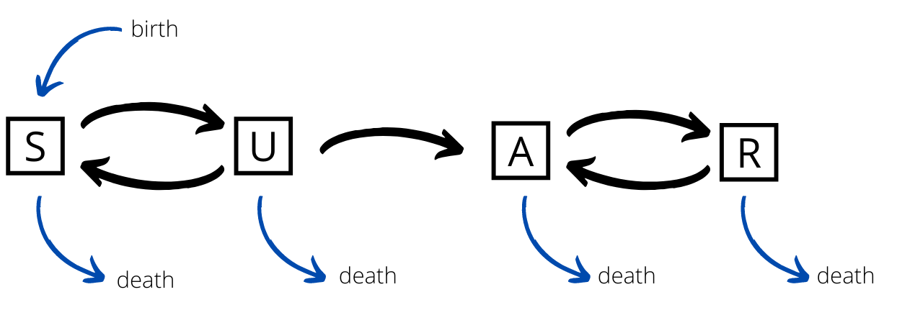

# Preface

This was written as a University project but I'm pretty happy with how it turned out.

Big thanks to Kevin Dai and Chrysovalantis Thomopoulos who worked with me on this throughout the semester.


\newpage

# Introduction
Drugs are chemical substances with physiological effects. Some drugs like opioids, cannabis, alcohol, nicotine, cocaine, methamphetamine, or heroin are of concern to policymakers. Widespread drug abuse in a community can be a burden to society and the economy. For example, healthcare costs increase due to bodily harm, there is an enhanced risk of infectious diseases through second-hand needle injections, indirect funding of organized crime occurs, and there are negative impacts on mental health and rehabilitation. Further harms of drug abuse upon the abuser may include financial instability, death, and familial grief.

"Number one is the opioid epidemic. It is a scourge across our country. A person dies every 12-and-a-half minutes from an opioid overdose and that's far too many. Especially when we know that many of those deaths can be prevented." (Thedoctors.com, 2021)

These were the words of Dr. Adams, the 20th surgeon general of the United States when asked about his main concerns and focus indicating the severity of the matter. Substance abuse is not only harmful for oneself but our community. Multiple research articles and papers in the past have modeled drug use. We have included some examples below from which we have taken inspiration and made comparisons.

One article in particular by Mushanyu, J, Nyabadza, F, Muchatibaya, G, & Stewart, A G. R. (2016) touches on the importance of an adequate healthcare system since a limited rehabilitation capacity can increase the chances of a drug abuse epidemic. The methods used in this paper are discussed later. Also, Mushanyu, J, Nyabadza, F, & Stewart, A G R. (2015) focuses on some matters that are of great importance as well.

Having an understanding of the dynamics of drug use will inform decision makers' strategies to minimize drug use. In this paper, we aim to understand how drug use and addiction develop in a community and what factors can be tweaked to alter the long-term distributions of drug use, abuse, and addiction in the community.

# Aim
The aim of this project is to produce a model to capture the dynamics of drug use in the long term. The model should address how or when individuals become drug users, addicted drug users, and abstainers, and have applications in addressing economic and policy decisions.


# Method

## Initial Model: SIR
It's common to liken drug use to disease, treating drug addiction as an infection that can be recovered from. Using this analogy, we began looking into how diseases are modeled and how we can adapt our own model to fit drug usage.
One of the simplest drug models is the SIR model, a compartment model based on the concept of mass action that sees infections as caused by interactions between infected people and susceptible people. The use of mass action can be justified in this case as we are looking at large populations over a long period of time, meaning that the variance in the movement will average out over time.
There are a few reasons that this model is a good starting point for any type of drug modeling:
Firstly, this model is very simple and can be easily adapted to our own needs with extra compartments and transferable conditions.
Secondly, since we are looking at drug use in a population, relying on mass action rather than discrete modeling allows us to further simplify the model.
Thirdly, the idea that addiction is caused by interactions between individuals seems to be a good assumption for drug use as one would expect people to become familiar and subsequently addicted to certain substances by being associated with people who have them.

One divergence we made from the most basic SIR model is allowing for relapse from the recovered group back into the infected group. This represents how recovering addicts will become addicted again at a different rate than people who have never used the drug before. However, an important fact is that people cannot move back into the susceptible group as addiction is said to last a lifetime.


Our SIR model is defined by the following equations:
$$\frac{dS}{dt} = -\pi_1 * S * I $$
$$\frac{dI}{dt} = \pi_1 * S * I + \pi_2 * R * I - \pi_3 *  I $$
$$\frac{dR}{dt} = -\pi_2 * R * I + \pi_3 * I $$

The parameters $\pi_1$, $\pi_2$, and $\pi_3$ represent the 'infectiousness' of the drug for susceptible and recovering individuals and the rate of recovery from the drug, respectively.

We now look at some plots to see how this model behaves for various combinations of our parameters:

```{python, echo=FALSE, SIRsims}
import numpy as np
import pandas as pd
import matplotlib.pyplot as plt
from euler_methods import *

# Assuming SIR is a function that creates a plot and does not call plt.show()

# Set up a 2 by 2 grid of subplots
plt.figure(figsize=(10, 10))  # Adjust the figure size if necessary

# First plot
plt.subplot(2, 2, 1)
SIR(0.001, 0.02, 0, 70, 20, 10, 100)

# Second plot
plt.subplot(2, 2, 2)
SIR(0.009, 0, 0.04, 70, 20, 10, 100)

# Third plot
plt.subplot(2, 2, 3)
SIR(0.001, 0.05, 0.5, 70, 20, 10, 100)

# Fourth plot
plt.subplot(2, 2, 4)
SIR(0.0001, 0.001, 0.1, 70, 20, 10, 100)

# Finally, use plt.show() to display all the plots at once in the Rmd file
plt.tight_layout()  # Optional: this improves spacing between plots
plt.show()

```

## SUAR Model
The SIR model fails to distinguish between different severities of addiction. By grouping the individuals who are trying/testing the drug with people who are addicted, we fail to capture the behavior of people trying the drug without becoming reliant on it.
Because of this, we adapted the SIR model, relabeled the infected group to addicted, and added in a new compartment model for users of the drug who are not addicted, the 'using' group. Susceptible people will now move into the using group before moving into the Addicted group. Since there are now two groups who are using the drug and interacting with the community, the $I$ terms of the ODEs in the SIR model have to be replaced with $U+A$.


The new model can now be described by the following equations:

$$\frac{dS}{dt} = - \pi_1*S*(A+U) + \pi_2*U   $$
$$\frac{dU}{dt} =  \pi_1*S*(A+U) - \pi_2*U  - \pi_3*U $$
$$\frac{dA}{dt} = \pi_3*U +\pi_5 *(A+U)*R - \pi_4*A $$
$$\frac{dR}{dt} =  \pi_4*A - \pi_5 *(A+U)*R $$

With parameters $\pi_1$, $\pi_2$, $\pi_3$, $\pi_4$, and $\pi_5$ being the 'effectiveness' of the drug for susceptible people, the rate that people stop trying the drug, the rate at which people become addicted, the recovery rate for addicted people respectively, and the 'effectiveness' for recovered people.

```{python, echo = FALSE, SUARsims}

# Create a new figure with a specified size
plt.figure(figsize=(12, 12))

# Each subplot for SUAR function calls
# First SUAR plot
plt.subplot(2, 2, 1)
SUAR(0.01,0.001,0.001, 0.001, 0.001 ,60,20,10,10,100)

# Second SUAR plot
plt.subplot(2, 2, 2)
SUAR(0.001,0.01,0.001, 0.001, 0.001 ,60,20,10,10,100)

# Third SUAR plot
plt.subplot(2, 2, 3)
SUAR(0.001,0.001,0.01, 0.001, 0.001 ,60,20,10,10,100)

# Fourth SUAR plot
plt.subplot(2, 2, 4)
SUAR(0.001,0.001,0.001, 0.01, 0.001 ,60,20,10,10,100)

# Improve spacing between plots and show them all
plt.tight_layout()
plt.show()


```


## SAUR Model with age
Now focusing on the stationary points of the previous two models (see appendix for derivation), we realize that our long-term behavior involves the extinction of either the user and/or the addicted group. However, this behavior is unrealistic and rather too optimistic since there is a consistent number of people using and addicted to the drug, and a consistently high number of people who are susceptible to the drug. To fix this issue, we integrate age groups into the model, grouping the population into children, teens, young adults, adults, and seniors. Each of these groups has a distinct rate of death, and the births are proportional to the number of young adults and adults. Separating the population also allows us to set different parameters according to each age group, capturing more nuanced behaviors such as an increased volume of experimentation of young people which would not have been identified otherwise.

Another feature we wanted to tackle is how people recover. In the same way that people start using drugs based on interactions with others who are using them, we expect people to recover based on interactions with people who aren't using them. This can be represented by support groups, concerned parents, friends, etc. Furthermore, we can expect people in one age group and compartment model to be influenced differently from each age group and subsequent compartment model. We can store this information with a matrix $I$, where $I_{ij}$ is the magnitude of the influence that group j has on group i.

We can now go in to further simplify this by defining two new terms, the positive and negative influence on a age group $i$, to be:
$$P_i = \sum{k=1}{5}{I_{ik} * (S_k + R_K)}$$
$$N_i = \sum{k=1}{5}{I_{ik} * (U_k + A_K)}$$

The model now has 20 compartments with both sideways movement from and to age groups and downwards movement as people age.

Looking across age group 'i', the model can be described as:

$$\frac{dS_i}{dt} = aS_{i-1} + aU_{i-1} \pi_{i-1,2}P_{i-1} - S_i\pi_{i,1}N_i + (1-a)U_i\pi_{i,2}P_i - aSi - d_{i,s}S_i + (b\sum_{k=2}^{3}S_k+U_k+A_k+R_K | i = 0)  $$
$$\frac{dU_i}{dt} =  aS_{i-1}\pi_{i-1,1}N_{i-1} + aU_{i-1} - U_i * \pi_{i,3} - a U_i - U_i\pi_{i,2}P_i + (1-a)S_i\pi_{i,1}N_i - d_{i,U}U_i$$
$$\frac{dA_i}{dt} = aU_{i-1}\pi_{i-1,3} + aA_{i-1} + aR_{i-1}\pi_{i-1,5}N_{i-1} - A_i\pi_{i,4}P_i + (1-a)R_i\pi_{i,5}N_{i}-aA_i + (1-a)U_i\pi_{i,3}- d_{i,A}A_i$$
$$\frac{dR_i}{dt} = aA_{i-1}\pi_{i-1,4}P_{i-1} + aR_{i-1} - aR_i -R_i\pi_{i,5}N_i + (1-a)A_i\pi_{i,4}P_i - d_{i,R}R_I $$

With the parameters being sorted in matrices $\pi$, {d} and {i}, containing row-wise versions of the parameters for the SAUR model, the death rate for each compartment, and the influence that each age group has on the other, and scalars $a$ and $b$, which define the aging rate and the birth rate of the population.

```{python suar20, echo = FALSE}
aging_rate = 0.05
birth_rate = 0.07
death_rate = 0.1*np.array([[0.2, 0.2, 0.2, 0.2],
                           [0.05, 0.05, 0.05, 0.05],
		           [0.1, 0.1, 0.1, 0.1],
			   [0.2, 0.2, 0.2, 0.2],
			   [0.5, 0.5, 0.5, 0.5]])

X0 = 100 * np.array([[5, 0, 0, 0],
                     [10, 10, 0, 0],
		     [10, 5, 5, 0],
		     [10, 20, 0, 0],
		     [10, 0, 0, 0]])

(n_age_groups, n_status) = np.shape(X0)

I =  0.001*np.array([[0.1, 0.0, 0.2, 0.5, 0.2],
                     [0.0, 0.5, 0.2, 0.2, 0.1],
                     [0.0, 0.1, 0.7, 0.2, 0.0],
                     [0.0, 0.0, 0.1, 0.8, 0.1],
                     [0.0, 0.0, 0.0, 0.5, 0.5]])

P = 0.1*np.array([[0.0, 1.0, 0.5, 0.0, 1.0],
                  [0.5, 0.5, 0.5, 0.8, 0.2],
                  [0.5, 0.5, 0.5, 0.6, 0.2],
                  [0.1, 0.1, 0.5, 0.6, 0.1],
                  [0.0, 0.0, 0.5, 0.9, 0.1]])

SUAR_20(aging_rate,birth_rate,death_rate, I, P, X0,600)

```

## Simplified SUAR Model with age

After creating the SAUR model with age groups, we experimented with various combinations of parameters to see how the model reacted. 
However, we found that with 20 compartments and 73 parameters, it is really hard to go through all the combinations to find meaningful results from the model. We could see that there were stationary points for the population portions, but finding them analytically was near impossible. Because of this, we sought to find a way to simplify the model to produce results that are easier to understand. We did this by removing the different age groups altogether, while keeping the equations describing the model the same. By removing the age groups, the equations dramatically simplify into this form;




$$\frac{dS}{dt} = -S\pi_{1}N +U\pi_2P  -d_SS + b(S+U+A+R)  $$
$$\frac{dU}{dt} = S\pi_1N -U\pi_2P - U\pi_3 - d_UU  $$
$$\frac{dA}{dt} = U\pi_3 - A\pi_4P + R\pi_5N - d_AA$$
$$\frac{dR}{dt} = A\pi_4P - R\pi_5N - d_RR $$

```{python, echo = FALSE, SUAR_5Sims }

plt.figure(figsize=(12, 12))

# The grid of subplots for the SUAR_5 function calls
# First SUAR_5 plot
plt.subplot(2, 2, 1)
SUAR_5(0.01, 0.001, 0.001, 0.001, 0.001, 0.001, [0.0001, 0.0005, 0.001, 0.0001], 60, 20, 10, 10, 300)

# Second SUAR_5 plot
plt.subplot(2, 2, 2)
SUAR_5(0.001, 0.01, 0.001, 0.001, 0.001, 0.001, [0.0001, 0.0005, 0.001, 0.0001], 60, 20, 10, 10, 300)

# Third SUAR_5 plot
plt.subplot(2, 2, 3)
SUAR_5(0.001, 0.001, 0.01, 0.001, 0.001, 0.001, [0.0001, 0.0005, 0.001, 0.0001], 60, 20, 10, 10, 300)

# Fourth SUAR_5 plot
plt.subplot(2, 2, 4)
SUAR_5(0.001, 0.001, 0.001, 0.01, 0.001, 0.001, [0.0001, 0.0005, 0.001, 0.0001], 60, 20, 10, 10, 300)

# Adjust layout to prevent overlapping of subplots and then display all the plots
plt.tight_layout()
plt.show()

```

Looking at this model, it is clear to see that we will only find stationary points when births and deaths are equal. However we also want to see long term trends in growing and shrinking populations. To do this, we look at this model through population portions, redefining the system as:

$$ T = S + U + A + R $$
$$ T' = b(S+U+A+R)  -d_SS -d_UU - d_AA - d_RR $$


$$ \frac{d\frac{S}{N}}{dt} = \frac{(-S\pi_{1}N +U\pi_2P  -d_SS + b(S+U+A+R))T-T'S}{T^2} $$ 
$$ \frac{d\frac{U}{N}}{dt} = \frac{(S\pi_1N -U\pi_2P - U\pi_3 - d_UU )T-T'U}{T^2} $$
$$ \frac{d\frac{A}{N}}{dt} = \frac{(U\pi_3 - A\pi_4P + R\pi_5N - d_AA)T-T'A}{T^2}  $$
$$ \frac{d\frac{R}{N}}{dt} = \frac{(A\pi_4P - R\pi_5N - d_RR )T-T'R}{T^2} $$

Denoting these fractions as s,u,a,r and reformatting the equation using T as a characteristic for population and $\frac{1}{b}$ as a characteristic for time;

$$ s+u+a+r = 1$$
$$ \frac{ds}{dt} = (-s\pi_{1}(u+a)+u\pi_2(s+r)  -d_Ss + 1)-s(1 - d_Ss - d_Uu - d_Aa - d_Rr) $$ 
$$ \frac{du}{dt} = (s\pi_{1}(u+a)-u\pi_2(s+r) - u\pi_3 -d_Uu )-u(1 - d_Ss - d_Uu - d_Aa - d_Rr) $$
$$ \frac{da}{dt} = (u\pi_3 -a\pi_4(s+r) + r\pi_5(u+a) -d_Aa )-a(1 - d_Ss - d_Uu - d_Aa - d_Rr)  $$
$$ \frac{dr}{dt} = (a\pi_4(s+r) - r\pi_5(u+a) -d_Rr )-r(1 - d_Ss - d_Uu - d_Aa - d_Rr)$$


```{python, echo = FALSE, SUARnormsims }

# Initialize a new plot with a specific figure size
plt.figure(figsize=(12, 12))

# Arrange the SUAR_norm function calls in a 2x2 subplot grid
# Plot 1 in the top-left position (1st row, 1st column)
plt.subplot(2, 2, 1)
SUAR_norm(10,1,1,1,1,[0.1,0.5,1,0.1],0.6,0.2,0.1,0.1,50,0.1)

# Plot 2 in the top-right position (1st row, 2nd column)
plt.subplot(2, 2, 2)
SUAR_norm(1,10,1,1,1,[0.1,0.5,1,0.1],0.6,0.2,0.1,0.1,50,0.1)

# Plot 3 in the bottom-left position (2nd row, 1st column)
plt.subplot(2, 2, 3)
SUAR_norm(1,1,10,1,1,[0.1,0.5,1,0.1],0.6,0.2,0.1,0.1,50,0.1)

# Plot 4 in the bottom-right position (2nd row, 2nd column)
plt.subplot(2, 2, 4)
SUAR_norm(1,1,1,10,1,[0.1,0.5,1,0.1],0.6,0.2,0.1,0.1,50,0.1)

# Improve the spacing between the plots
plt.tight_layout()

# Finally, show all the plots
plt.show()

```

# Results


We can think of deaths as a movement from all compartments to the susceptible compartments. This makes it clear that a stationary point exists when all the people are in the susceptible compartment, meaning the drug is 'extinct'. Similarly, the drug is also extinct when everyone is either in the recovered or susceptible group, as one just has to wait for the recovered people to die for the portion of S to reach 1. These two facts can be seen in appendix 3. Let the stationary point at $s=1$ be the trivial stationary point.

However, for some combinations of parameters, secondary stationary points are found. These non-trivial stationary points could not be found analytically using MATLAB 2021b, therefore their existence must be verified on a case-by-case basis, using the code in appendix 4. 
Note that all the death parameters were set to one, meaning that these results are for drugs where the rate of death is independent of the compartment. To find results for other sets of death parameters, line 25 of appendix 4 should be altered.

Using the table of non-trivial stationary points (appendix 10), we can now plot the number of combinations of parameters that lead to non-trivial stationary points pairwise by parameter.


```{python, simforallparams, echo = FALSE}

res = pd.read_csv('ss.csv')
use =  pd.read_csv('avg.csv')

res.columns = ['p1','p2','p3','p4','p5', 'extinct']
use.columns =  [ 'p1','p2','p3','p4','p5', 'p_using']

p = ['p1','p2','p3','p4','p5']

xlabels = ['-3','-2','-1','0','1','2','3']
fig, axs = plt.subplots(5, 5)
for i, a in enumerate(p):
    for j, b in enumerate(p):
        if i != j:
            w = res[[a, b, 'extinct']].groupby([a, b]).sum().unstack()
            t = axs[i, j].pcolormesh(w, vmin=0, vmax=216)
        if i == 4:
            axs[i, j].set_xticks(np.arange(7) + 0.5, minor=False)
            axs[i, j].set_xticklabels(xlabels, fontdict=None, minor=False)
            axs[i, j].set_xlabel('Log2(' + b + ')')
        else:
            axs[i, j].get_xaxis().set_visible(False)
        if j == 0:
            axs[i, j].set_yticks(np.arange(7) + 0.5, minor=False)
            axs[i, j].set_yticklabels(xlabels, fontdict=None, minor=False)
            axs[i, j].set_ylabel('Log2(' + a + ')')
        else:
            axs[i, j].get_yaxis().set_visible(False)

fig.subplots_adjust(right=0.8)
cbar_ax = fig.add_axes([0.85, 0.15, 0.05, 0.7])
c = fig.colorbar(t, cax=cbar_ax)
fig.suptitle("Number of combinations that have Non-trivial stationary points \n ds=1, du=1, da=1, dr=1 s0=0.6, u0=0.2, a0=0.1, r0=0.1, Total Sims = 216")
plt.show()

```

From this plot, one can see a big factor that influences the creation of these non-trivial stationary points is the magnitude of $\pi_1$, and to a lesser extent the ratio of $\pi_1$ and $\pi_2$. In this case, births will rapidly transition to the using category, meaning that they then have the potential to become addicted. 

Another result one can take from the data is the number of people who are using or addicted to the drug at the pseudo-stationary points, as shown in the plots below.

```{python pssp, echo = FALSE}

fig, axs = plt.subplots(5, 5)
for i , a in enumerate( p):
    for j , b in enumerate(p):
        if i !=j:
            w = use[[a,b,'p_using']].groupby([a,b]).mean()
            dk = pd.DataFrame(np.nan, columns=xlabels, index=xlabels)
            for l in xlabels:
                for m in xlabels:
                    try:
                        dk[m][l] = w.loc[(int(l), int(m))]
                    except:
                        pass


            t = axs[i,j].pcolormesh(dk, vmin = 0, vmax = 1)
        if i == 4:
            axs[i,j].set_xticks(np.arange(7) + 0.5, minor=False)
            axs[i,j].set_xticklabels(xlabels, fontdict=None, minor=False)
            axs[i,j].set_xlabel('Log2(' + b +')')
        else:
            axs[i,j].get_xaxis().set_visible(False)
        if j == 0 :
            axs[i,j].set_yticks(np.arange(7) + 0.5, minor=False)
            axs[i,j].set_yticklabels(xlabels, fontdict=None, minor=False)
            axs[i,j].set_ylabel('Log2(' + a +')')
        else:
            axs[i,j].get_yaxis().set_visible(False)

fig.subplots_adjust(right=0.8)
cbar_ax = fig.add_axes([0.85, 0.15, 0.05, 0.7])
c = fig.colorbar(t, cax=cbar_ax)
fig.suptitle("Average portion of people using or addicted at non-Trivial Stationary Points \n ds=1, du=1, da=1, dr=1 s0=0.6, u0=0.2, a0=0.1, r0=0.1, Total Sims = 216")
plt.show()


```
Looking at these plots we can see the following behaviors:

* Bigger $\pi_1$ $\to$ Higher Mean
* Bigger $\pi_2$ $\to$ Lower Mean
* Bigger $\pi_3$ $\to$ Lower Mean
* Bigger $\pi_4$ $\to$ Lower Mean
* Bigger $\pi_5$ $\to$ Higher Mean

Therefore, in terms of the long-term state of drug use in communities, the best way to minimize drug use is to minimize $\pi_1$ such that the drug becomes extinct. If this cannot be done, the number of people using or addicted to drugs can be minimized by lowering the values of $\pi_2, \pi_3, \pi_4$ or maximizing the value of $\pi_5$ to make the stationary point have a minimal number of people using the drug.

# Discussion


Contrasting the simplified SUAR model with Nyabadza et al  (2016) on crystal meth use in South Africa, the forcing parameter for a susceptible individual to transfer out of their compartment was a weighted sum of U and A rather than the sum scaled, furthermore, there was a forcing parameter dependent on the size of the drug supply chain.

Another downside of our model is the fact that we have not focused on one specific substance and rather decided to adopt a more general approach to the problem. When focusing on one substance and/or a "family" of substances such as in the paper by Mushanyu, J, Nyabadza, F, & Stewart, A G R. (2015) we can narrow down our results and get more specific and detailed answers.


A question posed by the model is how we arrive at the various states that we see at t = 0.
For non-illicit drugs like cigarettes and alcohol, marketing strategies from distributors like television ads, billboards etc. can persuade susceptible members to initiate. We suggest the forcing parameter to be a function of the industry's market cap. Australia has plain packaging laws to dampen the forcing parameter. For illicit drugs, the supply of the drug depends on network effects. Online drug markets like The Silk Road can be assumed to have no interaction with non-users. Its only effect is to the accessibility of drugs for people in compartments U and A. Adding in forcing functions into the model, and/or allowing the parameters to change as a function of time will allow for these events to be modeled.

Regarding the findings of the model, the way parameters are altered to change when the trivial stationary point is found, or the level of drug use in a nontrivial stationary point seem in line with common policies targeting drug minimization. By lowering the amount of people who start using the drug, such as Australia's ban on cigarette marketing. More generally, the results show that the best way to reduce drug use is to minimize the net movement from susceptible to using and recovered to addicted.

# Conclusion

The aim of this project was to model the long-term outcomes of drug use in a community.
Four models were developed: the initial SIR model, a modified SUAR model, the SUAR model with age-structure, then the simplified SUAR model with age.
For the closed population models, the simulations had one of two outcomes: no drug users or entirely drug users. When births and deaths are accounted for, the population can have endemic proportions of susceptible, using, addicted, and recovered members.
We found ways to push drug use to extinction by manipulating the transmission parameters.

# References

 1) Mushanyu, J, Nyabadza, F, Muchatibaya, G, & Stewart, A G. R. (2016). Modelling Drug Abuse Epidemics in the Presence of Limited Rehabilitation Capacity. Bulletin of Mathematical Biology, 78(12), 2364-2389. https://doi.org/10.1007/s11538-016-0218-5
 2) Mushanyu, J, Nyabadza, F, & Stewart, A G R. (2015). Modelling the trends of inpatient and outpatient rehabilitation for methamphetamine in the Western Cape province of South Africa. BMC Research Notes, 8(796), 797-797. https://doi.org/10.1186/s13104-015-1741-4
 3) Betterhealth.vic.gov.au. 2021. Drug use in Victoria - Better Health Channel. [online] Available at: <https://www.betterhealth.vic.gov.au/health/healthyliving/drug-use-in-victoria> [Accessed 21 October 2021].
 4) Thedoctors.com. 2021. U.S. Surgeon General Discusses the Opioid Epidemic. [online] Available at: <https://www.thedoctors.com/articles/u.s.-surgeon-general-discusses-the-opioid-epidemic/> [Accessed 21 October 2021].
 5) Caulkins, Jonathan P, Dietze, Paul, & Ritter, Alison. (2007). Dynamic compartmental model of trends in Australian drug use. Health Care Management Science, 10(2), 151-162. https://doi.org/10.1007/s10729-007-9012-0
 6) Harvim, P., Zhang, H., Georgescu, P., & Zhang, L. (2021). Cigarette smoking on college campuses: An epidemical modelling approach. Journal of Applied Mathematics and Computing, 65(1), 515-540. https://doi.org/10.1007/s12190-020-01402-y
 7) Nyabadza, F., Njagarah, J. B. H., & Smith, R. J. (2013). Modelling the Dynamics of Crystal Meth ('Tik') Abuse in the Presence of Drug-Supply Chains in South Africa. Bulletin of Mathematical Biology, 75(1), 24-48. https://doi.org/10.1007/s11538-012-9790-5


\newpage

# Appendix

## Appendix 1 : Stationary points of SIR model

$$0 = -\pi_1 * S * I $$
$$0 = \pi_1 * S * I + \pi_2 * R * I - \pi_3 *  I $$
$$0 = -\pi_2 * R * I + \pi_3 * I $$

Therefore either $\pi_1$, $S$ or $I$ must be 0

If $I = 0$:

$$0 = -\pi_1 * S * 0 $$
$$0 = \pi_1 * S * 0 + \pi_2 * R * 0 - \pi_3 *  0 $$
$$0 = -\pi_2 * R * 0 + \pi_3 * 0 $$

Therefore any point [$S$,0,$R$] is stationary.

If $\pi_1 = 0$ or $S=0$:

$$0 =  0 * I $$
$$0 = 0 * I + \pi_2 * R * I - \pi_3 *  I $$
$$0 = -\pi_2 * R * I + \pi_3 * I $$

Therefore:

$$ \pi_2 * R * I - \pi_3 *  I = - \pi_2 * R * I + \pi_3 *  I  $$
$$ \pi_2 * R * I = \pi_3 * I $$
$$ R:I = \pi_3:\pi_2 $$

Therefore any point [0, $\frac {P_{total}*\pi_2}{\pi_2 + \pi_3}$ ,$\frac {P_{total}*\pi_3}{\pi_2 + \pi_3}$]

## Appendix 2 : Stationary points of SUAR

$$0 = - \pi_1*S*(A+U) + \pi_2*U   $$
$$0 =  \pi_1*S*(A+U) - \pi_2*U  - \pi_3*U $$
$$0 = \pi_3*U +\pi_4 *(A+U)*R - \pi_5*A $$
$$0 =  \pi_5*A - \pi_4 *(A+U)*R $$

By combing the first two and last two equations, one can see that if the parameters are non 0, $U=0$. Therefore:

$$ 0 = \pi_1*S*A $$
$$0 = \pi_4 *A*R - \pi_5*A $$
$$0 =  \pi_5*A - \pi_4 *A*R $$

Therefore $S = 0$ or $A = 0$
In the case $A = 0$, any point [$S$,0,0,$R$] will be stationary

In the case $S=0$
$$ \pi_4*A*R = \pi_5*A$$
$$R:A = \pi_5:\pi_4$$

Therefore any point [0,0, $\frac {P_{total}*\pi_4}{\pi_4 + \pi_5}$ ,$\frac {P_{total}*\pi_5}{\pi_4 + \pi_5}$]

## Appendix 3: Critical Points of Simplified SUAR model

When s = 1:
$$ s = 1$$
$$ \frac{ds}{dt} = (-d_Ss + 1)-s(1 - d_Ss) = (1-S)(1-d_Ss)  = 0 $$ 
$$ \frac{du}{dt} = 0 $$
$$ \frac{da}{dt} = 0  $$
$$ \frac{dr}{dt} = 0  $$


When s+r = 1:
$$ s+r = 1$$
$$ s = 1 - r $$

$$ \frac{ds}{dt} = (-d_Ss + b)-s(1 - d_Ss - d_Rr)  = (1 -s)*(1 + d_r*s - d_s*s)$$ 
$$ \frac{du}{dt} = 0 $$
$$ \frac{da}{dt} = 0  $$
$$ \frac{dr}{dt} = (-d_Rr )-r(1 - d_Ss - d_Rr) = (s - 1)*(1 + d_r*s - d_s*s)$$


## Appendix 4: Matlab code for generating conditional Stationary Points

```{octave, eval = FALSE}
syms s u a r p1 p2 p3 p4 p5 ds du da dr


ode1 =  (-s*p1*(u+a)+u*p2*(s+r)  -ds*s + 1)-s *(1 - ds*s - du*u - da*a - dr*r);
ode2 =  (s*p1*(u+a)-u*p2*(s+r) - u*p3 -du*u )-u*(1 - ds*s - du*u - da*a - dr*r) ;
ode3 =  (u*p3 -a*p4*(s+r) + r*p5*(u+a) -da*a )-a*(1 - ds*s - du*u - da*a - dr*r);
ode4 =  (a*p4*(s+r) - r*p5*(u+a) -dr*r )-r*(1 - ds*s -du*u - da*a - dr*r);
sums = s+u+a+r;


odes = [ode1 == 0, ode2 == 0, ode3 == 0 , ode4 == 0, sums  == 1, s>=0, u >= 0, a >=0, r>=0];


ss = [];
avg = [];

k = 3;

for p1i = -k:k
for p2i   = -k:k
for p3i  = -k:k
for p4i  = -k:k
for p5i = -k:k
[p1, p2, p3, p4, p5, ds, du, da, dr] = deal(2^p1i, 2^p2i, 2^p3i, 2^p4i, 2^p5i,1,1,1,1);
sol = solve(subs(odes),'Real',true);
ss = [ss ; [p1i,p2i,p3i,p4i,p5i,length(sol.s) - 1]];
if length(sol.s) > 1
avg = [avg ; [p1i,p2i,p3i,p4i,p5i,mean(sol.u(2:length(sol.u)) + sol.a(2:length(sol.a)))]];
end;end;end;end;end;end


writematrix(double(avg),'avg.csv')
writematrix(double(ss), 'ss.csv')
```

## Appendix 5: Python code for simulating SIR model

```{python, echo = FALSE}

from inspect import getsource as gs
print(gs(SIR))
 
```

## Appendix 6: Python code for simulating SUAR model

```{python, echo = FALSE}

from inspect import getsource as gs
print(gs(SUAR))
 
```
## Appendix 7: Python code for simulating 20 compartment SUAR model

```{python, echo = FALSE}

from inspect import getsource as gs
print(gs(SUAR_20))
 
```
## Appendix 8: Python code for simulating 5 compartment SUAR model

```{python, echo = FALSE}

from inspect import getsource as gs
print(gs(SUAR_5))
 
```

## Appendix 9: Python code for simulating  5 compartment dimensionless SUAR model

```{python, echo = FALSE}

from inspect import getsource as gs
print(gs(SUAR_norm))
 
```


