Like many Australians, I spent my last Saturday in January getting hyped for the Triple J Hottest 100 countdown. And for the past few years, there has been a project run by [100 Warm Tunas](https://100warmtunas.com/) that has been remarkably accurate at predicting the results of the countdown.

Warm Tunas makes predictions by scraping social media posts for people's votes and then collating them as a sample of all votes. While this method is highly effective, I feel that it misses the point a bit when it comes to understanding why a song is popular.

Therefore, this year, I have set out to determine the top songs in the 2023 countdown without relying on anything related to the voting itself.

## My Hypotheses

Heading into this, I have a few ideas as to factors that will make a song perform well in the countdown:

### Plays on Triple J

I feel this factor is pretty self-explanatory. If a song is being played a lot on Triple J, it's most likely popular with the listener base and will get more votes in the Hottest 100.

### Chart Success

This one is a bit weirder, as I don't think that just getting to number one in the ARIA charts will make you a top pick for Triple J listeners. Otherwise, the countdown would be topped by the year's biggest pop hits. If a song is too popular in the mainstream, it seems to fall out of favor with Triple J listeners. However, there are some notable exceptions to this, such as "Bad Guy" by Billie Eilish and "Thrift Shop" by Macklemore, which both took out the top spot in their respective years.

### Time of Release and Peak

This idea is commonly thrown around when talking about the Oscars, so I feel that it's probably going to be applicable to the Hottest 100 as well. Being at peak popularity when people are voting is probably going to be useful. Similarly, a song that hung around for a long time will probably be voted for more than a song that only hung around for a week.

# Play Data

I gathered the data for all plays on Triple J for the last 8 years from their [API](https://music.abcradio.net.au/api/v1/plays/search.json?limit=100&offset=0&page=0&station=triplej), which left me with a dataset that looks like this:

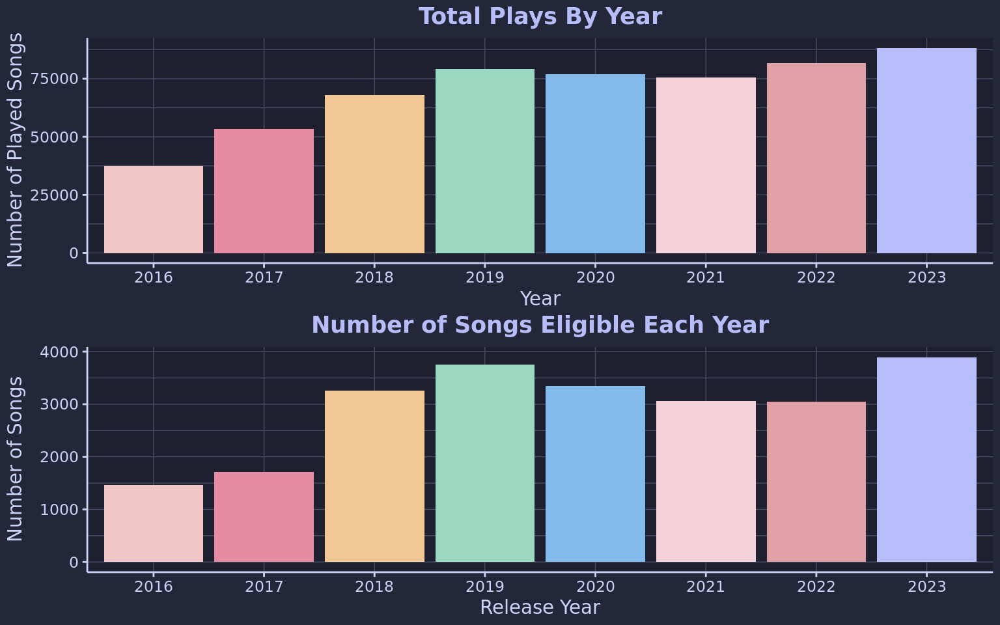

## Number of Plays

To me, the most obvious indicator of a song's popularity is the number of plays it receives. So, we can start by examining that.

\`\`\`rrxppwppv e option I use for blogs as I want to make sure to avoid re-rendering old posts unless I explicitly do so.

freeze: auto - Re-render only when

p1 \<-combined_plays %\>%
filter(release_year \>= 2016 & release_year \<= 2023) %\>%
filter(release_year == Year) %\>%
group_by(release_year, Song, Artist) %\>%
summarize(
first_timestamp = ymd_hms(min(timestamp)),
total_plays = n(),
.groups = "drop"
) %\>%
ggplot(aes(x = first_timestamp, y = total_plays, color = factor(release_year))) +
geom_point() +
scale_color_catppuccin(palette = "macchiato") +
labs(x = "Date of First Play", y = "Total Number of Plays", title = "Total Number of Plays In Release Year", color = 'Release Year') +
scale_y_continuous(limit = c(0, NA))

p2 \<- combined_plays %\>%
filter(release_year \>= 2016 & release_year \<= 2023) %\>%
filter(release_year == year(ymd_hms(timestamp))) %\>%
count(Song) %\>%
group_by(n) %\>%
summarize(number_of_songs = n(), .groups = "drop") %\>%
filter(number_of_songs \> 1) %\>%
ggplot(aes(x = n, y = number_of_songs)) +
geom_line(color = "#cad3f5") + \# Changed to line chart
geom_point(color = '#bb9af7') + \# You can keep points to show exact data spots
labs(x = "Total Number of Plays", y = "Number of Songs", title = "Line Chart of Songs vs Total Plays by Release Year") +
scale_y_log10()

p1 / p2

    These plots give us a good insight into the trends in how Triple J selects songs. We have a lot of songs with almost no plays, which are mostly songs that are being presented to the audience to gauge their reaction. If they become popular, the songs will be played frequently, indicated by the absence of songs with 40-60 plays. However, very few songs receive excessive playtime, with only a handful surpassing 200 plays.

    We can also observe the impact of being released early in the year, as these songs have more opportunities to be played throughout the year, resulting in a downward slope for each year.

    ## How Total Plays Impact Success

    ::: {.cell}
    ::: {.cell-output-display}
    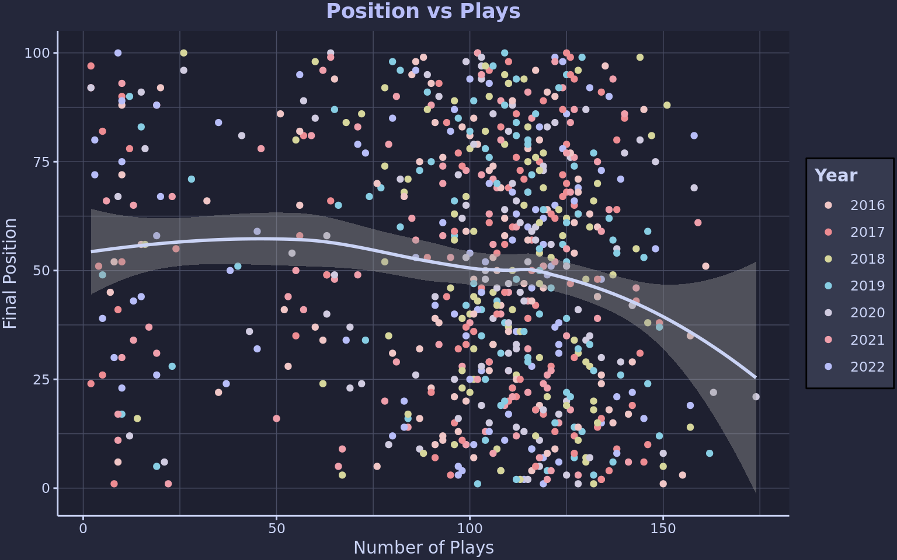{width=768}
    :::
    :::

    Looking at the rankings, we can see that the total number of plays doesn't have a massive impact on performance. A song can have five plays or a hundred, and it seems to have a similar outcome in the rankings.

    There is a slight downward trend for songs getting over 120 plays, as these are the absolute most played songs for the year. However, this status still doesn't guarantee a top spot.

    ## Accounting for Time

    A thought I had while looking at the absolute play data is that it disproportionately rewards songs that were released earlier in the year. 

    To address this, I have compiled some statistics that consider the peak of the songs, which should eliminate any advantage for being released at the beginning of the year.

    ::: {.cell}
    ::: {.cell-output-display}
    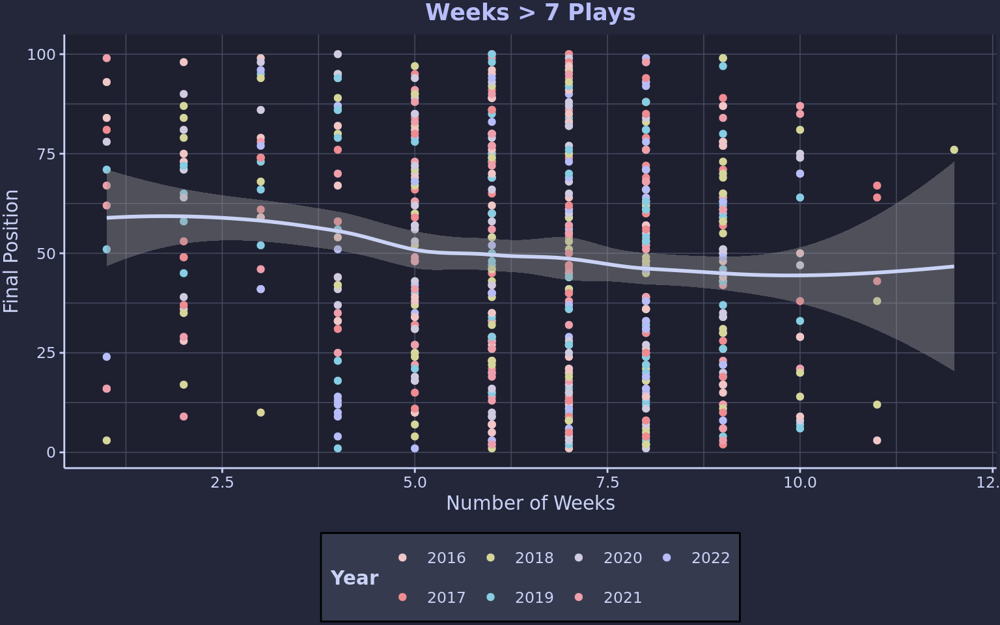{width=768}
    :::

    ::: {.cell-output-display}
    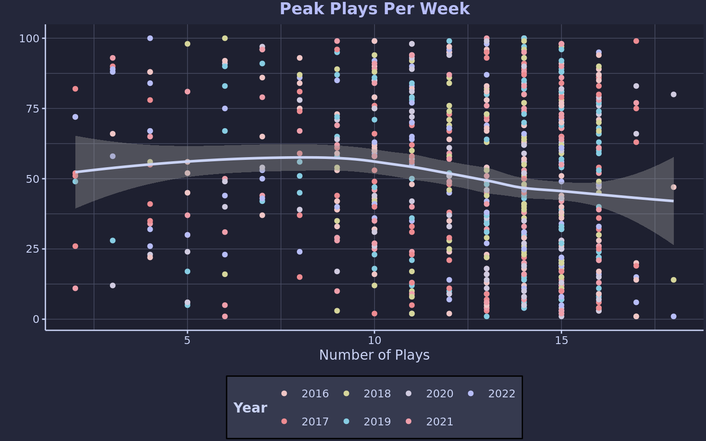{width=768}
    :::

    ::: {.cell-output-display}
    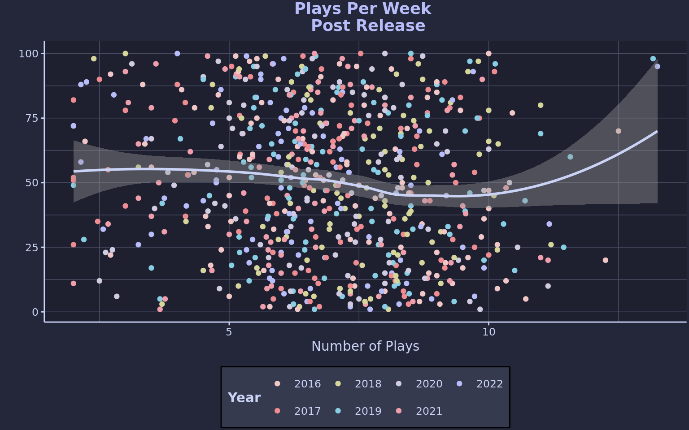{width=768}
    :::
    :::

    Again, we can see that there is some useful information, with the peak plays per week showing that songs which have a big peak generally perform well in the final rankings. However, as with the absolute count of plays, there doesn't seem to be a hard and fast rule.

    # Chart Success

    The ARIA charts collate music sales and streaming data within Australia and produce a weekly list of the top 50 most popular songs. A GitHub user has been kind enough to [compile all of these lists](https://raw.githubusercontent.com/caseybriggs/ARIA-charts/main/single_charts.csv), so we can simply load them and compare the chart results to a song's position in the Hottest 100.

    ::: {.cell}
    ::: {.cell-output-display}
    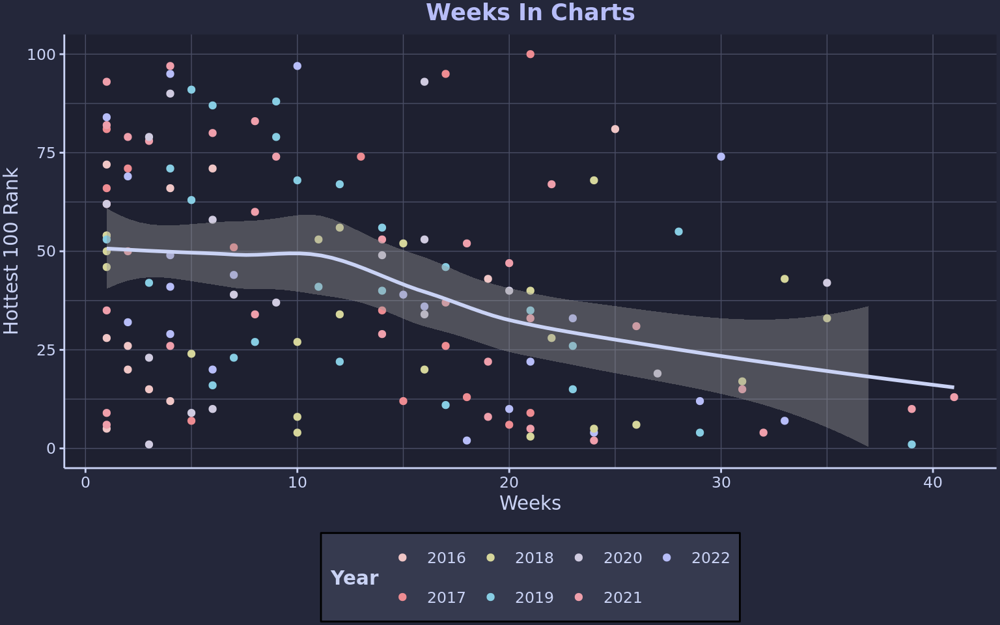{width=768}
    :::

    ::: {.cell-output-display}
    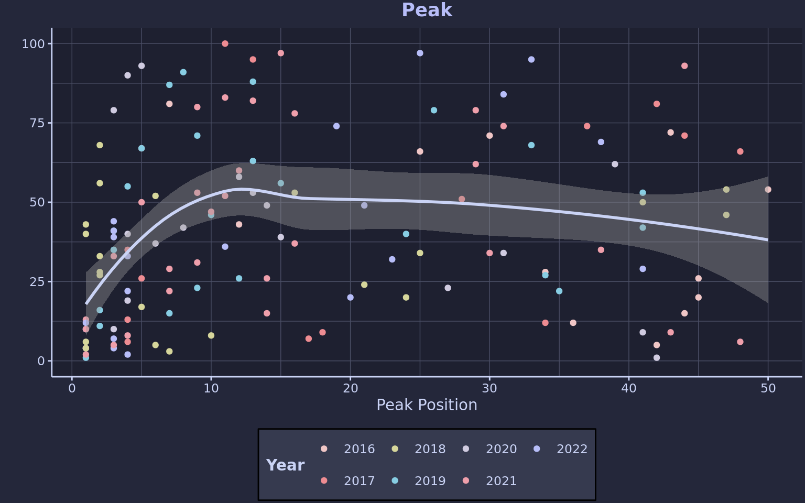{width=768}
    :::

    ::: {.cell-output-display}
    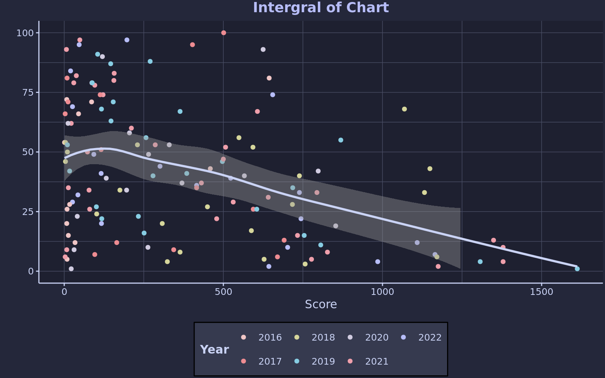{width=768}
    :::
    :::

    The first thing to note is that these plots are much sparser than the rest. This is because many songs played on Triple J don't make it into the top 50 at all, even though they make it into the Hottest 100.

    For the songs that did make it into the ARIA charts and hung around, they consistently performed well in the countdown. Examples include "Bad Guy" by Billie Eilish and "Dance Monkey" by Tones and I, which claimed the 1st and 4th spots in their respective years.

    However, the predictive power of this statistic is again quite limited. Many songs that performed well in the Hottest 100 had poor chart success. For instance, "Redbone" by Childish Gambino took the 5th spot in 2015 despite only spending a single week in the charts at rank 42.

    ::: {.cell}
    ::: {.cell-output-display}
    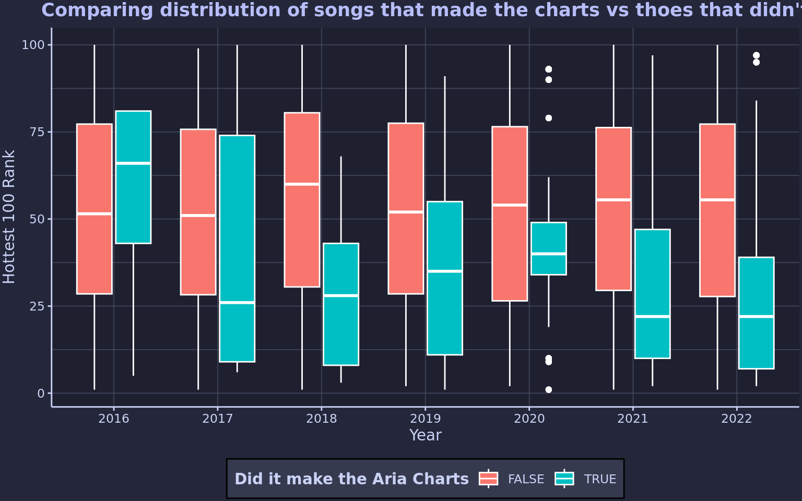{width=768}
    :::
    :::

    From this chart, we can see that songs that make the charts are outperforming songs that don't. But more importantly, it shows us that making the charts is not a deal-breaker on whether or not a song will perform well in the Hottest 100.

    # Timing

    Another thing I wanted to look at was when and how the songs peaked in the play data. Maybe being the popular song would help the song perform around the time that voting is open, which may help with its performance in the final rankings.

    ::: {.cell}
    ::: {.cell-output-display}
    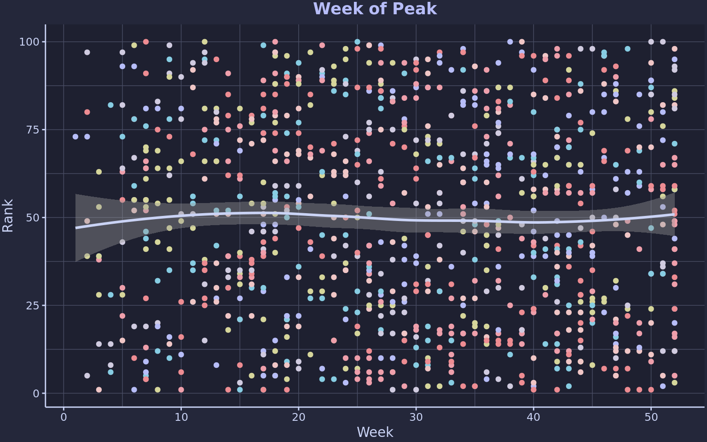{width=768}
    :::

    ::: {.cell-output-display}
    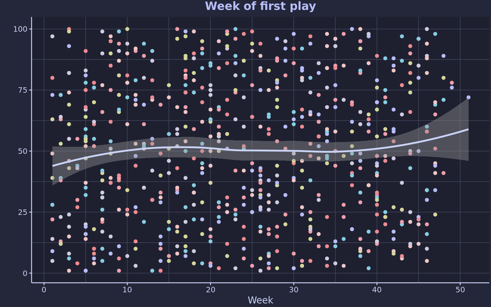{width=768}
    :::
    :::

    Looking at the above plots, we can see that the week of release or peak really doesn't matter when looking at the final results.

    I went on to see if the shape of the peaks looks different for well-performing songs versus poorly performing songs, and again, nothing seems particularly interesting or different between the two.

    ::: {.cell}
    ::: {.cell-output-display}
    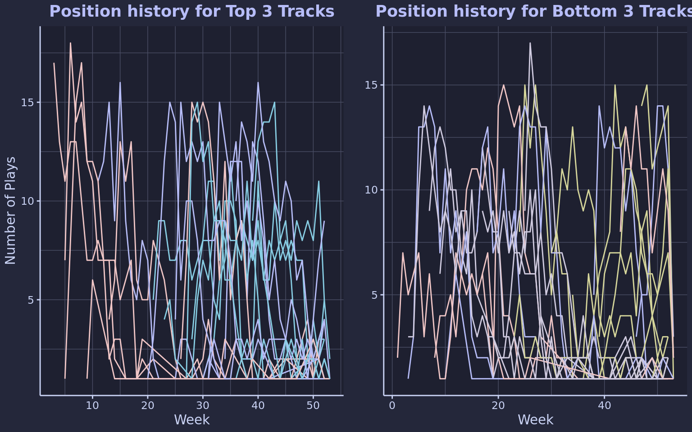{width=768}
    :::
    :::

    # Where we are going wrong

    So it seems that all of my hypotheses are incorrect, and I believe the reason for this is that there is too much variation among the top 100. This is because these songs are already considered the best of the year from a pool of nearly 4000.

    ::: {.cell}
    ::: {.cell-output-display}
    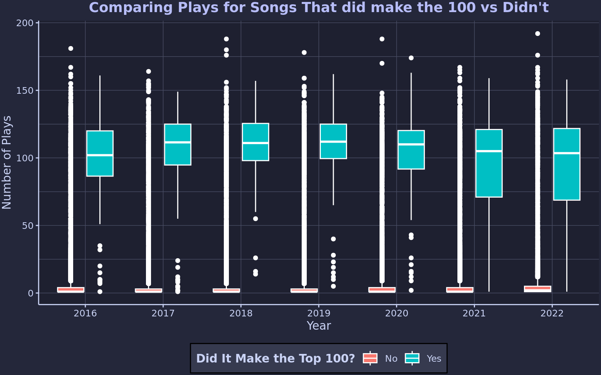{width=768}
    :::
    :::

    Looking at this plot, we can see right away that a song that made the Hottest 100 got more plays than those that didn't, but also that plenty of songs that didn't make the 100 got a comparable number of plays.

    # Screw it XGBoost

    ::: {.cell}

    :::

    I think the direction to go here is to see if we can use ML to find any trends that aren't showing up in the plots.

    To do this, we are going to use XGBoost to train a model to predict the rank of the song using all the stats I wrote out above. The only thing I changed was taking the first play data and setting it to be the month rather than the day to reduce overfitting. For any song that didn't make it into the 100, I set the rank to be 101, as it could be the 101st most popular song that year.

    ::: {.cell}
    ::: {.cell-output-display}
    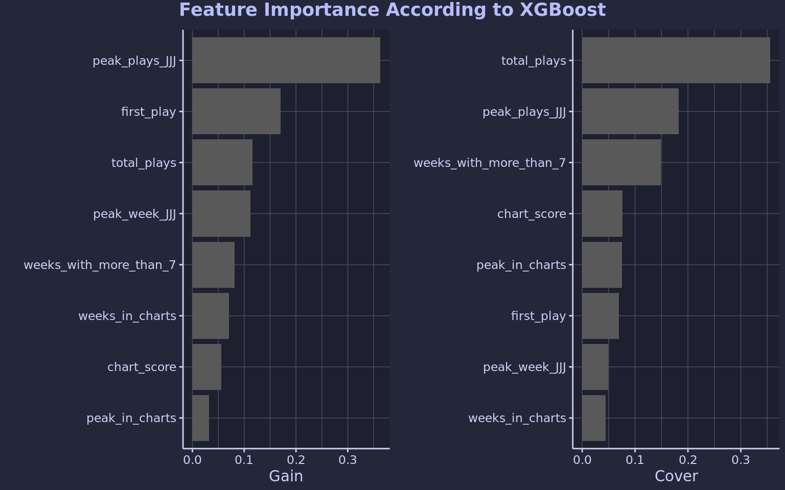{width=768}
    :::
    :::

    A nice thing about XGBoost is that it can provide insight into the most important factors it uses to predict the results. From the above plots, we can see that the peak of the song on triple J and its total plays contribute significantly to the predictive power. 

    Interestingly, the chart scores seem to have little effect. However, this can be justified by considering the fact that many songs that make the top 100 never make the charts.

    Now that we have the model, we can evaluate its performance in predicting the Hottest 100 by applying it to the play data from 2022.

    ::: {.cell}

    :::

    ### 2022 Predicted Countdown

    ::: {.cell}
    ::: {.cell-output .cell-output-stdout}

                        Song          Artist Actual

1 b.o.t.a. eliza rose 2
2 say nothing flume 1
3 glimpse of us joji 10
4 bad habit steve lacy 4
5 first class jack harlow 12
6 about damn time lizzo 7
7 sitting up spacey jane 6
8 get inspired genesis owusu 17
9 in the wake of your leave gang of youths 9
10 shirt sza 20
11 hardlight spacey jane 3
12 stars in my eyes ball park music 8
13 stranger days skegss 19
14 god is a freak peach prc 16
15 it's been a long day spacey jane 5
16 thousand miles the kid laroi 33
17 backseat of my mind thelma plum 21
18 2 be loved lizzo 36
19 facts of life lime cordiale 15
20 doja central cee 39

    :::
    :::

    ### 2022 Real Countdown

    ::: {.cell}
    ::: {.cell-output .cell-output-stdout}

                        Song          Artist Predicted

1 say nothing flume 2
2 b.o.t.a. eliza rose 1
3 hardlight spacey jane 11
4 bad habit steve lacy 4
5 it's been a long day spacey jane 15
6 sitting up spacey jane 7
7 about damn time lizzo 6
8 stars in my eyes ball park music 12
9 in the wake of your leave gang of youths 9
10 glimpse of us joji 3
11 gay 4 me g flip 29
12 first class jack harlow 5
13 new gold gorillaz 24
14 delilah fred again 27
15 facts of life lime cordiale 19
16 god is a freak peach prc 14
17 get inspired genesis owusu 8
18 stranger days skegss 13
19 shirt sza 10
20 backseat of my mind thelma plum 17

    :::
    :::

    From this, I reckon the model is doing pretty well, so lets have a look at my final predictions for the hottest 100 of 2023.

    # My Final Predictions

    The list below seems pretty reasonable, with Doja Cat taking the top spot and my pick for number one, Rush, sitting in 10th. There seems to be a big lean towards pop and a lack of your classic Triple J-style indie rockers, but that might just be the turnout for this year.

    ::: {.cell}
    ::: {.cell-output .cell-output-stdout}

                         Song                Artist

1 paint the town red doja cat
2 vampire olivia rodrigo
3 what was i made for? billie eilish
4 sprinter dave
5 nanana peggy gou
6 love type poolclvb
7 green honda benee
8 super ego babe rainbow
9 kill bill sza
10 rush troye sivan
11 greedy tate mcrae
12 strangers kenya grace
13 sweat you out my system maya
14 chemical post malone
15 adored royel otis
16 bad idea right? olivia rodrigo
17 lovin on me jack harlow
18 houdini dua lipa
19 got me started troye sivan
20 barbie world nicki minaj
21 lost without you san cisco
22 super-vision dice
23 agora hills doja cat
24 blak britney miss kaninna
25 glue song beabadoobee
26 ruthless hooligan hefs
27 attention doja cat
28 james dean tash sultana
29 never felt so alone labrinth
30 my love mine all mine mitski
31 water tyla
32 still have room hockey dad
33 do it again benee
34 trippin up the jungle giants
35 i wish you roses kali uchis
36 dash of speed rum jungle
37 too much the kid laroi
38 eyes ahead dice
39 spin me like your records pacific avenue
40 adore u fred again
41 dogtooth tyler
42 pets and drugs the rubens
43 imposter syndrome lime cordiale
44 into your room holly humberstone
45 love again the kid laroi
46 up lee
47 pegasus arlo parks
48 exploding angie mcmahon
49 stockholm dice
50 calling metro boomin
51 must be nice ruel
52 better love eliza rose
53 your funeral maya
54 don't let me down gus dapperton
55 the worst person alive g flip
56 conceited lola young
57 messed up holy holy
58 lost in the rush telenova
59 candle flame jungle
60 one of your girls troye sivan
61 minivan the rions
62 perfect for you peach prc
63 prescription remi wolf
64 change laurel
65 angel pinkpantheress
66 sinner the last dinner party
67 midwest vacations
68 pretty girl ice spice
69 good enough g flip
70 take what you want the rions
71 i wanna dance royel otis
72 rhyme dust mk
73 boys light up chillinit
74 make up your mind cordae
75 viper room thornhill
76 weightless arlo parks
77 letting go angie mcmahon
78 can't play myself skepta
79 black mascara. raye
80 feel alive cat
81 tied up! genesis owusu
82 fine day anthem skrillex
83 we don't talk about it thelma plum
84 mrs. hollywood gojo
85 am i dreaming metro boomin
86 comma's onefour
87 lola maya
88 it's cool to be in love greta stanley
89 since i have a lover 6lack
90 prada cass
91 lil boo thang paul russell
92 nothing matters the last dinner party
93 going kokomo royel otis
94 all my life lil durk
95 brain freeze northeast party house
96 healing molly millington
97 sticky kito
98 rakata the jungle giants
99 lost the breakup maisie peters
100 f u goodbye peach prc
\`\`\`

:::
:::
